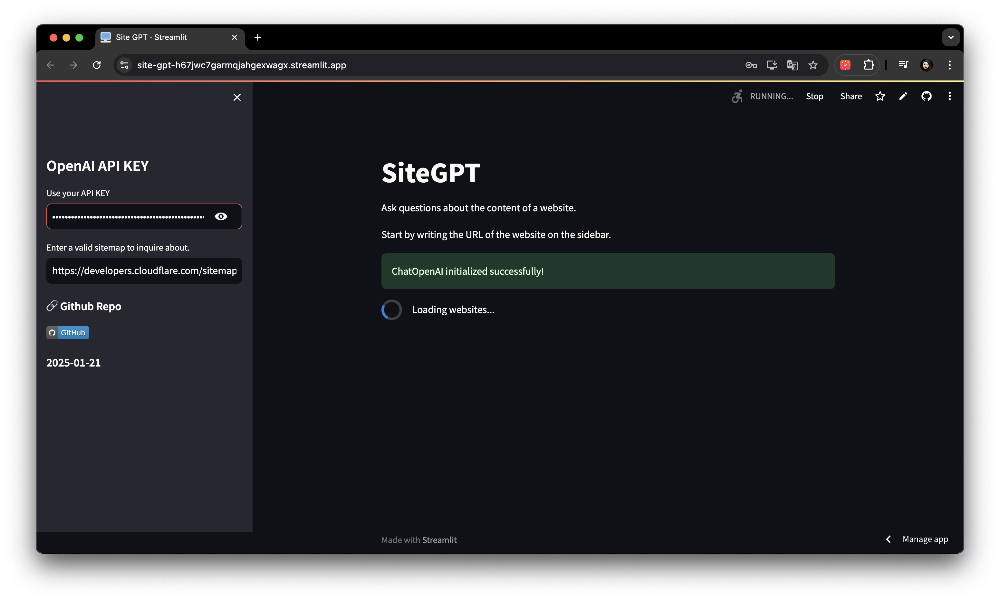
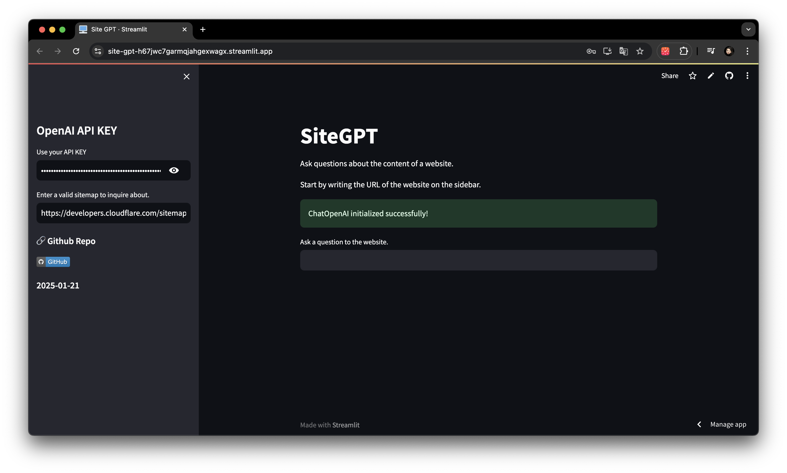
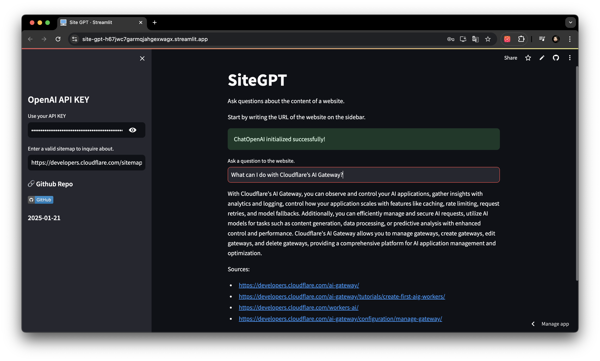

# SiteGPT

### Date: 2025-01-21

**Nomad Coders - FullstackGPT #10.0 ~ 10.6**

## ⚒️ Task
1. [x] Build a SiteGPT for Cloudflare's documentation
2. [x] The chatbot should be able to answer questions
   - AI Gateway
   - Cloudflare Vectorize
   - Workers AI
3. [x] Use sitemap to find all the documentation pages
4. [x] Allow the user to use its own OpenAI API key
5. [x] put a link to the GitHub repo using st.sidebar

## 📸 Screenshots

